# PROJECT-1 [WEB STACK IMPLEMENTATION (LAMP STACK)]

## *STEP 0

-Create an AWS account
 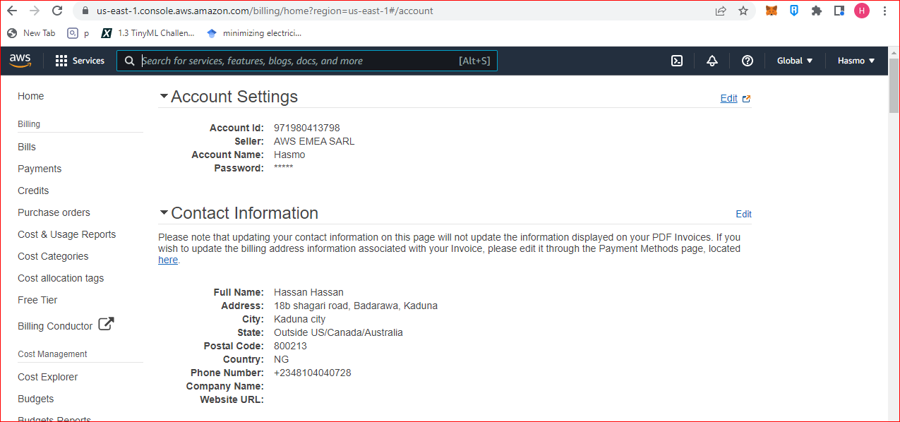

-connect EC2
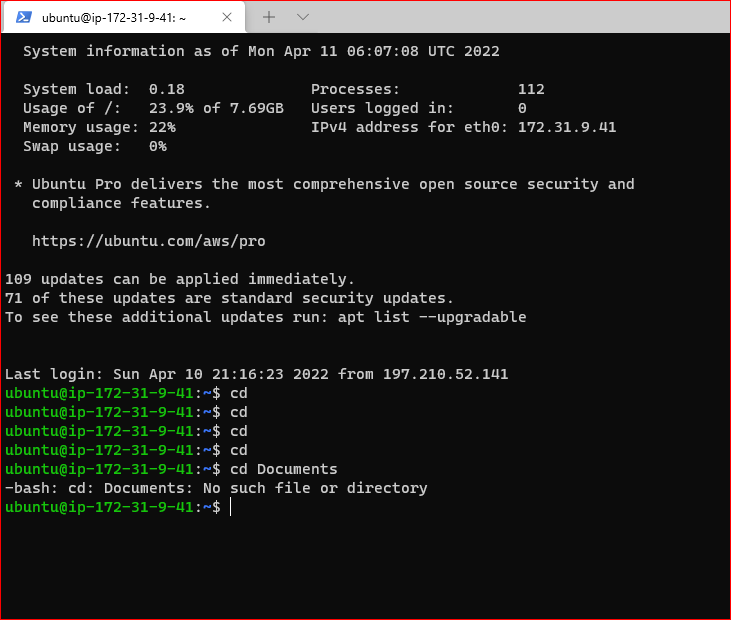
 ## *STEP 1

-INSTALLING APACHE AND UPDATING THE FIREWALL

-update a list of packages in package manager

`sudo apt update`

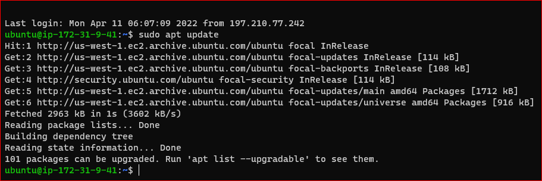

-run apache2 package installation

`sudo apt install apache2`

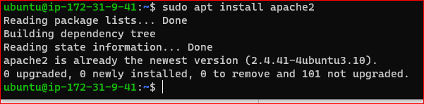

-verify that apache2 is running as a Service in our OS

`sudo systemctl status apache2`

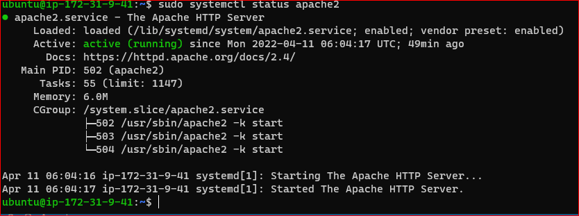

-access port 80 locally

`curl http://localhost:80`

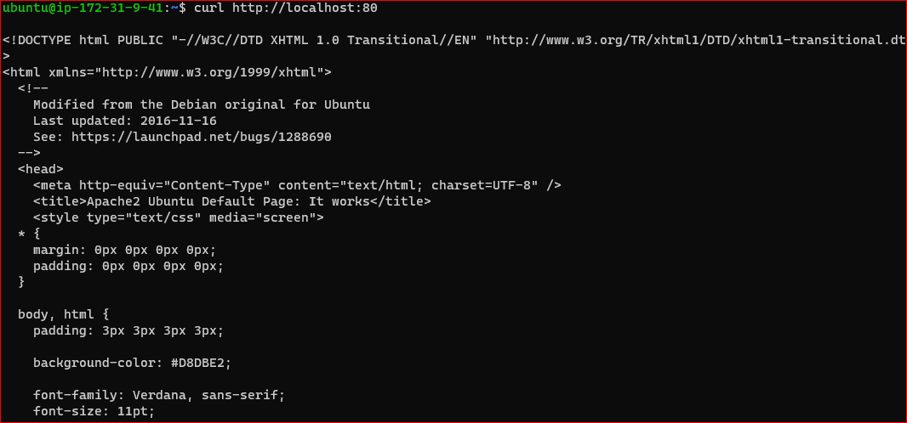

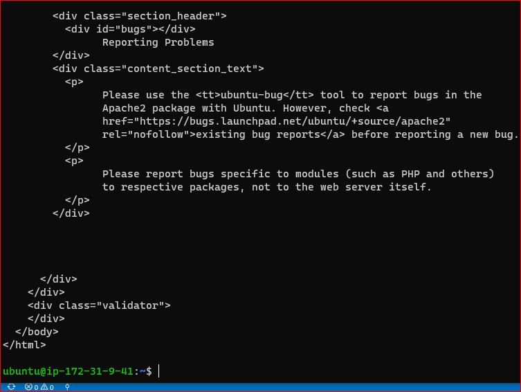

-Open a web browser of your choice and try to access following url
`http://<Public-IP-Address>:80`

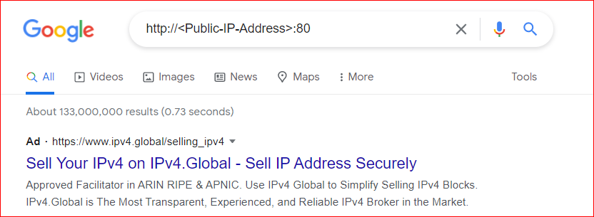

-retrieving ip address in command prompt

`curl -s http://169.254.169.254/latest/meta-data/public-ipv4`

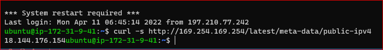

## *STEP 2

-INSTALLING MYSQL

-install mysql through terminal

`sudo apt install mysql-server`

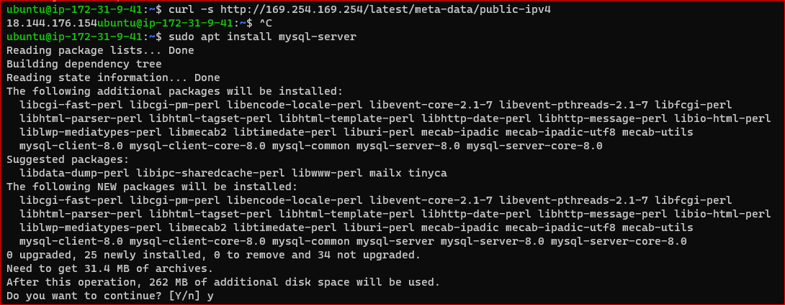

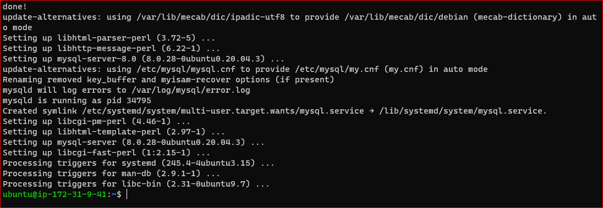

-testing mysql

`sudo mysql_secure_installation`

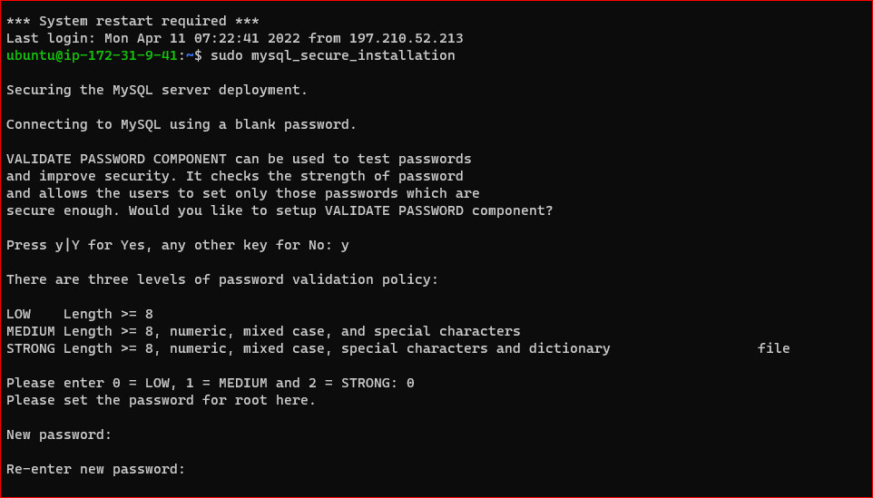

-login mysql

`sudo mysql`

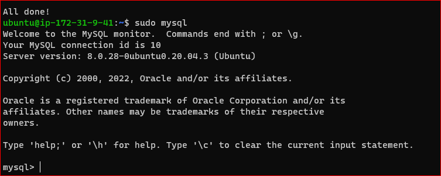

-exit mysql

`exit`

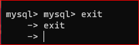

## *STEP 3

-INSTALLING PHP

-installing PHP

`sudo apt install php libapache2-mod-php php-mysql`

`php -v`

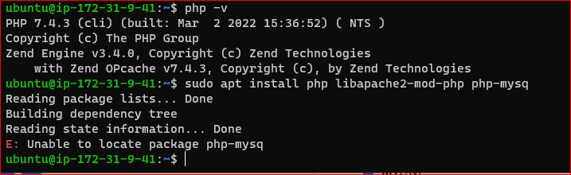

## *STEP 4 

—CREATING A VIRTUAL HOST FOR YOUR WEBSITE USING 
 APACHE

`sudo mkdir /var/www/projectlamp`

`sudo chown -R $USER:$USER /var/www/projectlamp`

`sudo vi /etc/apache2/sites-available/projectlamp.conf`

<VirtualHost *:80>

    ServerName projectlamp
    ServerAlias www.projectlamp 
    ServerAdmin webmaster@localhost
    DocumentRoot /var/www/projectlamp
    ErrorLog ${APACHE_LOG_DIR}/error.log
    CustomLog ${APACHE_LOG_DIR}/access.log combined
</VirtualHost>

`sudo ls /etc/apache2/sites-available`

`sudo a2ensite projectlamp`

`sudo a2dissite 000-default`

`sudo apache2ctl configtest`

`sudo systemctl reload apache2`

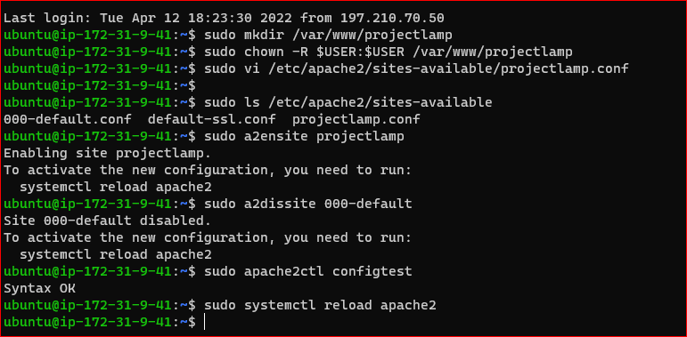

-Create an index.html file in that location so that we can test that the virtual host works as expected

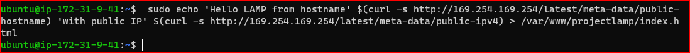

## *STEP 5 

—ENABLE PHP ON THE WEBSITE

-http://13.52.235.5:80

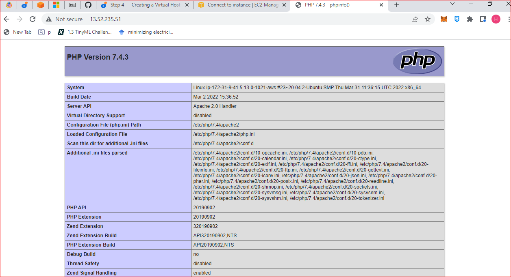

-remove the file you created

`sudo rm /var/www/projectlamp/index.php`

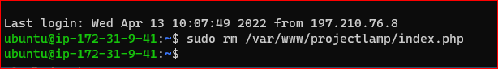

# *END OF PROJECT-1*

