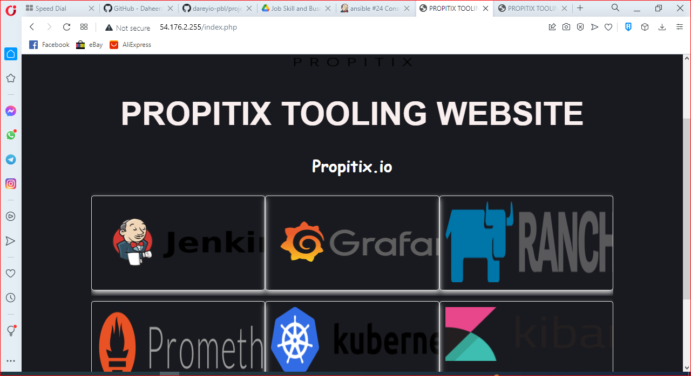

# Step 1: Jenkins Job Enhancement
  ## Before we begin, let us make some changes to our Jenkins job - now every new change in the codes creates a separate directory which is not very convenient when we want to run some commands from one place. Besides, it consumes space on Jenkins serves with each subsequent change. Let us enhance it by introducing a new Jenkins project/job - we will require Copy Artifact plugin.
- ## Go to the Jenkins-ansible server and in the home directory of the ubuntu user, create a new directory named ansible-config-mgt
- ## Change permissions of the folder so Jenkins can save files there.
  
  `sudo chmod -R 777 /home/ubuntu/ansible-config-mgt`
  
- ## Go to Jenkins web console -> Manage Jenkins -> Manage Plugins, click on Available tab and search for Copy Artifact. Install this plugin.


- ## Create a new Freestyle project and name it save_artifacts. This will be triggered on the successful build of your ansible job. Configure accordingly:
  
  - Click Discard old builds (we select this so Jenkins server will not run out of storage by keeping artifacts of old builds)
  - Enter Max number of builds to keep (pick any number you think is useful between 2 and 5)
  - For Build Triggers, select Build after other projects are built and enter ansible in the Projects to watch field.
  - Create a Build step and choose Copy artifacts from other project, specify ansible as source project and /home/ubuntu/ansible-config-mgt as target directory. For artifacts to copy, enter **. Test setup by editing README.md file in the repo (right in the master branch.)
  - If both Jenkins jobs build successfully, you should see the artifacts in the ansible-config-mgt directory.
  

# Step 2: Refactor Ansible Code
- ## Pull the new code from GitHub, create and checkout to a new branch named refactor
    
    `git pull origin master`

    `git checkout -b refactor`
    
    # This is where we will make all our refactoring changes before merging into master branch.
    
- ## Within playbooks folder, create site.yml file. This will serve as our primary playbook.
- ## Create a folder in the root directory of the repo named static-assignments. This is where we will store secondary playbooks (the name of this folder can be anything you like.)
- ## Move common.yml file to the static-assignments folder
- ## Inside site.yml file, import the common.yml playbook
    ```
    ---
    - hosts: all
    - import_playbook: ../static-assignments/common.yml
    ```
    This uses the Ansible import_playbook module.
    Directory structure should look like this:
    ```
    ├── static-assignments
    │   └── common.yml
    ├── inventory
        └── dev
        └── stage
        └── uat
        └── prod
    └── playbooks
        └── site.yml
    ```
- ## Run ansible playbook against the dev environment
  - Create a common-del.yml file to remove wireshark from the dev servers
 ```   
    ---
- name: update web, nfs servers
  hosts: webservers, nfs
  remote_user: ec2-user
  become: yes
  become_user: root
  tasks:
  - name: delete wireshark
    yum:
      name: wireshark
      state: removed

- name: update LB, db servers
  hosts: lb, db
  remote_user: ubuntu
  become: yes
  become_user: root
  tasks:
  - name: delete wireshark
    apt:
      name: wireshark-qt
      state: absent
      autoremove: yes
      purge: yes
      autoclean: yes
  ```  
  - Update the site.yml file with:
    ```
    - import_playbook: ../static-assignments/common-del.yml
    ```
  - Run the playbook
    ```
    ansible-playbook -i /home/ubuntu/ansible-config-mgt/inventory/dev.yml /home/ubuntu/ansible-config-mgt/playbooks/site.yml
    ```
    Ensure wireshark is removed by checking one or two of the servers.
    

    

# Step 3: Configure UAT Webservers with a webserver role
- ## Stop or terminate every other instance except Jenkins-ansible and launch two RHEL 8 servers named Web1-UAT and Web2-UAT
- ## To create a role, you must create a roles directory. If you have ansible installed on your local machine, do:
    ```
    mkdir roles (in the root directory of your repo)
    cd roles
    ansible-galaxy init webserver
    ```
    ## If you don't have ansible installed, just create your folders and files like so:
    ```
    └── webserver
        ├── README.md
        ├── defaults
        │   └── main.yml
        ├── handlers
        │   └── main.yml
        ├── meta
        │   └── main.yml
        ├── tasks
        │   └── main.yml
        └── templates
    ```
- ## Update your ansible-config-mgt/inventory/uat.yml with the private IP address of your UAT webservers.
```
[uat-webservers]
<Web1-UAT-Server-Private-IP-Address> ansible_ssh_user='ec2-user' 

<Web2-UAT-Server-Private-IP-Address> ansible_ssh_user='ec2-user'
```
- ## In the /etc/ansible/ansible.cfg file, uncomment the roles_path attribute and provide the absolute path to your roles folder
    ```
    roles_path = /home/ubuntu/ansible-config-mgt/roles
    ```
- Run the export

  `export ANSIBLE_CONFIG=<path-to-ansible.cfg>`

  `unset ANSIBLE_CONFIG`   
- ## Edit roles/webserver/tasks/main.yml file to do the following:
  - Install and configure Apache
  - Clone tooling website from your GitHub repo
  - Ensure tooling/html is deployed to /var/www/html
  - Make sure httpd service is started
```
    ---
- name: install apache
  become: true
  ansible.builtin.yum:
    name: "httpd"
    state: present

- name: install git
  become: true
  ansible.builtin.yum:
    name: "git"
    state: present

- name: clone a repo
  become: true
  ansible.builtin.git:
    repo: https://github.com/donhasmo/tooling.git
    dest: /var/www/html
    force: yes

- name: copy html content to one level up
  become: true
  command: cp -r /var/www/html/html/ /var/www/

- name: Start service httpd, if not started
  become: true
  ansible.builtin.service:
    name: httpd
    state: started

- name: recursively remove /var/www/html/html/ directory
  become: true
  ansible.builtin.file:
    path: /var/www/html/html
    state: absent
```

# Step 4: Reference Webserver role
- ## Within static-assignments folder, create a new file uat-webservers.yml and add the following lines
    ```
    ---
    - hosts: uat-webservers
      roles:
         - webserver
    ```
    ## and edit your site.yml like so:
    ```
    ---
    - hosts: all
    - import_playbook: ../static-assignments/common.yml

    - hosts: uat-webservers
    - import_playbook: ../static-assignments/uat-webservers.yml
    ```
# Step 5: Commit and test
- ## Commit your changes to the refactor branch and push to GitHub, create a pull request and merge with the master branch. The artifacts should be automatically copied to the ansible-config-mgt directory
- ## Run the playbook against your UAT servers
    ```
    ansible-playbook -i /home/ubuntu/ansible-config-mgt/inventory/uat.yml /home/ubuntu/ansible-config-mgt/playbooks/site.yaml
    ```
    
    ## You should be able to reach your webservers by \<public-ip-address>/index.php
   