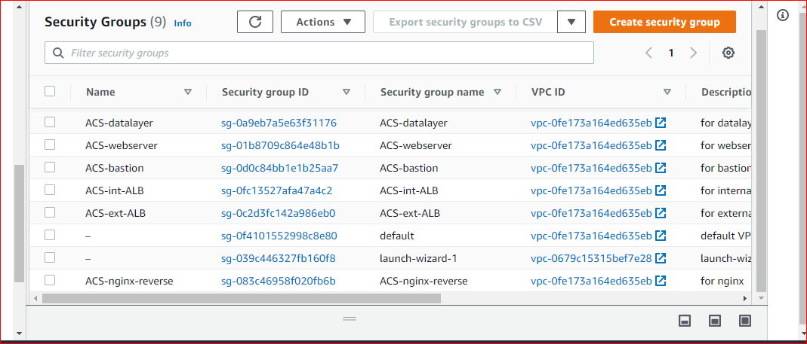
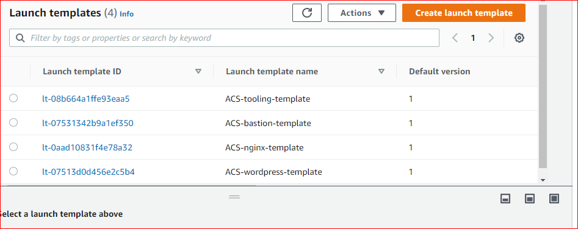
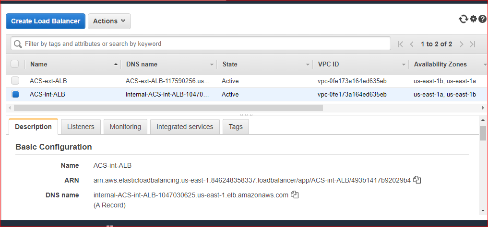
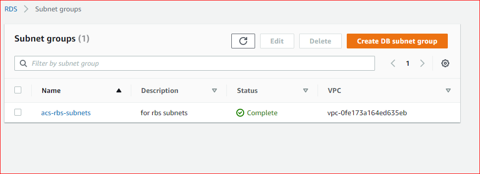
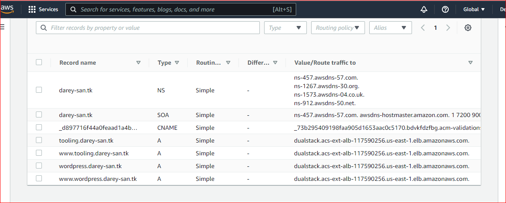
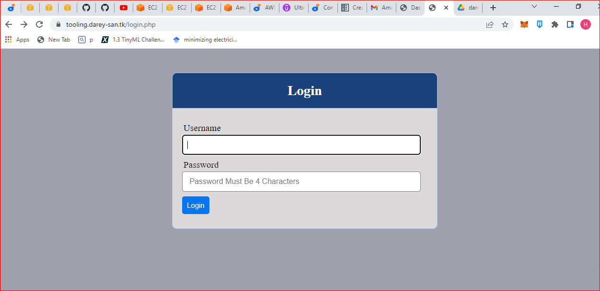
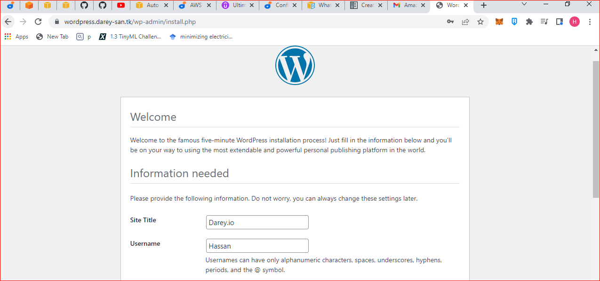

# Starting Off Your AWS Cloud Project
## Pretasks:
- Configure AWS account and Organization Unit
  
  - Create an AWS account (ignore if you already have one)
  - Create an Organization Unit 
  - Click 'Add an AWS account' and create a new AWS account from there with name as DevOps (you'll need another email address)
    
  - Login to the newly created account 
- Create a free domain name from http://www.freenom.com
- Create a hosted zone in AWS Route 53
  - Go to the Route 53 Console
  - Click 'Create Hosted Zone'
  - For Domain name, enter the domain name you got from freenom
  - Enter a description (if you wish)
  - For type, select Public Hosted Zone
    
  - Click Create Hosted Zone
  - Click on the created hosted zone and copy the contents of the NS record
  - Click 'Manage Domain' next to your domain name, and click Management Tools and select Nameservers
  - Click 'Use custom nameservers' radio button
  - Replace the content there with the items you got from Route 53 (one per line)
    
- Ensure to tag all resources you create (Project, Environment, Name etc)

## Step 1: Setup a Virtual Private Cloud

- Create a VPC from the VPC Management Console use a large enough CIDR block (/16)
- Create subnets as shown in the diagram above
  
  - For the public subnet, enable auto-assign IP by selecting the subnet (after you've created it) and clicking Actions button on the top right, then select Modify auto-assign IP settings and enable it
- Create a route table and associate it with the public subnets
  - Select the route table you created, click Actions on the top and click 'Edit Subnet associations'
  - Select the public subnets and click save
- Create a route table for the private subnets
  - Repeate the steps above
- Create an Internet Gateway, select it and click Actions the click Attach to VPC and attach it to the VPC you created
- Add a new route to your public subnet route table
  - Select the route table, click Actions and 'Edit routes'
  - For destination, enter 0.0.0.0/0
  - For target, select Internet Gateway and click the Internet Gateway you created
  - Click Save
- Create a NAT Gateway for your private subnets (create one in each public subnet)
- Allocate three Elastic IPs and attach one of them to the NAT Gateway
- Add a new route to your private route table with destination as 0.0.0.0/0 and target as the NAT Gateway you created
  
  
- Create a security group for:
  - Nginx servers: Access to nginx servers should only be from the Application Load Balancer
  - Bastion servers: Access to bastion servers should only be from the IPs of your workstation
  - Application Load Balancer: ALB should be open to the internet
  - Webservers: Webservers should only be accessible from the Nginx servers
  - Data Layer: This comprises the RDS and EFS servers. Access to RDS should only be from Webservers, while Nginx and Webservers can have access to EFS
  

## Step 2: Proceed with Compute Resources
### Step 2.1: Setup Compute Resources for Nginx
- Provision EC2 Instances for Nginx
  - Create a t2.micro RHEL 8 instance in any of your two public AZs
  - Install the following packages (we will be installing these packages a lot, so you can write a basic Ansible playbook that installs them)
    ```
    epel-release
    python
    htop
    ntp
    net-tools
    vim
    wget
    telnet
    ```
  - Create an AMI from the instance
    - Right click on the instance
    - Select Image and click Create Image
    - Give the AMI a name
- Prepare Launch Template for Nginx
  - From EC2 Console, click Launch Templates from the left pane
  - Choose the Nginx AMI
  - Select the instance type (t2.micro)
  - Select the key pair
  - Select the security group
  - Add resource tags
  - Click Advanced details, scroll down to the end and configure the user data script to update the yum repo and install nginx
    ```
    #!/bin/bash
    yum update -y
    yum install -y nginx
    systemctl start nginx
    systemctl enable nginx
    ```
    
- Configure Target Groups
  - Select instances as target type 
  - Enter the target group name
  - Select the VPC you created
  - For health checks, select HTTPS and health check path as /healthstatus
  - Add Tags
  - Register Nginx instances as targets


- Configure Autoscaling for Nginx
  - Enter the name
  - Select the Nginx launch template, click Next
    
  - Select the VPC and select the two public subnets you created, click Next
  - For health checks, select ELB too. Click Next.
  - For Group size, enter 2 for minimum and desired capacity, 4 as maximum capacity
  - For Scaling policies, select Target Tracking scaling policy and set the target value as 90
  - Click Next and add Notifications, create a new SNS topic and enter your email under 'With these recipients'
  - Add Tags
### Step 2.2: Setup Compute Resources for Bastion
- Provision EC2 Instances for Bastion server
  - Create a t2.micro RHEL 8 instance in any of your two public AZs where you created Nginx instances
  - Install the following packages
    ```
    epel-release
    python
    htop
    ntp
    net-tools
    vim
    wget
    telnet
    ```
  - Attach an Elastic IP to each of the servers
  - Create an AMI from the instance
    - Right click on the instance
    - Select Image and click Create Image
    - Give the AMI a name
- Prepare Launch Template for Nginx
  - From EC2 Console, click Launch Templates from the left pane
  - Choose the Bastion AMI
  - Select the instance type (t2.micro)
  - Select the key pair
  - Select the security group
  - Add resource tags
  - Click Advanced details, scroll down to the end and configure the user data script to update the yum repo and install nginx
    ```
    #!/bin/bash
    yum update -y
    yum install -y ansible git
    ```
- Configure Target Groups
  - Select instances as target type 
  - Enter the target group name
  - Select the VPC you created
  - For health checks, select HTTPS and health check path as /healthstatus
  - Add Tags
  - Register Bastion instances as targets
- Configure Autoscaling for Nginx
  - Enter the name
  - Select the Bastion launch template, click Next
  - Select the VPC and select the two public subnets you created, click Next
  - For health checks, select ELB too. Click Next.
  - For Group size, enter 2 for minimum and desired capacity, 4 as maximum capacity
  - For Scaling policies, select Target Tracking scaling policy and set the target value as 90
  - Click Next and add Notifications, create a new SNS topic and enter your email under 'With these recipients'
  - Add Tags

### Step 2.3: Setup Compute Resources for Webservers
We have to create two launch templates for Wordpress and Tooling respectively.
- Provision two EC2 Instances one for Tooling and another for Wordpress
  - Create a t2.micro RHEL 8 instance in any of your two public AZs where you created Nginx instances
  - Install the following packages
    ```
    epel-release
    python
    htop
    ntp
    net-tools
    vim
    wget
    telnet
    ```
  - Attach an Elastic IP to each of the servers
  - Create an AMI from the instance
    - Right click on the instance
    - Select Image and click Create Image
    - Give the AMI a name
- Prepare Launch Template for Webservers
  - From EC2 Console, click Launch Templates from the left pane
  - Choose the Tooling AMI
  - Select the instance type (t2.micro)
  - Select the key pair
  - Select the security group
  - Add resource tags
  - Click Advanced details, scroll down to the end and configure the user data script to update the yum repo and install nginx
    ```
    #!/bin/bash
    yum update -y
    yum install -y git php php-fpm php-mysqlnd
    ```
- Configure Target Groups
  - Select instances as target type 
  - Enter the target group name
  - Select the VPC you created
  - For health checks, select HTTPS and health check path as /healthstatus
  - Add Tags
  - Register Bastion instances as targets
- Configure Autoscaling for Nginx
  - Enter the name
  - Select the Bastion launch template, click Next
  - Select the VPC and select the two public subnets you created, click Next
  - For health checks, select ELB too. Click Next.
  - For Group size, enter 2 for minimum and desired capacity, 4 as maximum capacity
  - For Scaling policies, select Target Tracking scaling policy and set the target value as 90
  - Click Next and add Notifications, create a new SNS topic and enter your email under 'With these recipients'
  - Add Tags
    Repeat the above steps for Wordpress

    
### Step 2.5: TLS Certificates from Amazon Certificate Manager (ACM)
- Navigate to AWS ACM
- Under 'Provision certificates' click Get started
- Click Request a certificate
- Enter the domain name you registered (*.\<domain-name>.com), click next
- Select DNS validation and click Next
- Tag the certificate, click Review then confirm and request
- Click Continue
- Click 'Export DNS Configuration file'
- Go to Route 53
- Create a new CNAME record with items from the DNS configuration.csv file downloaded.
- Give a few seconds for validation to complete
  

### Step 2.4: Configure Application Load Balancer (ALB) for Nginx
Nginx instances should only accept connections coming from the ALB and deny any connections directly to it.
- Create an internet facing ALB
  - From the EC2 Console, click Load Balancers. 
  - On the block for Application Load Balancers, click create
  - Enter the name for the load balancer
  - Since it's for the Nginx servers, add a HTTPS Listener
  - Select the VPC you created, check the two AZs and add the public subnets you have. Click next.
  - Select the certificate you created on ACM
    
  - On the next page, select the ALB security group
  - Configure routing, select the Nginx target group
  - Register targets (unnecessary if you configured your target group correctly)
  - Click Review and complete the process

### Step 2.5: Configure ALB for Webservers
The ALB for the webservers should not be internet facing. And we'll need two ALBs, one for Tooling and Wordpress
- Create an internal ALB
  - From the EC2 Console, click Load Balancers. 
  - On the block for Application Load Balancers, click create
  - Enter the name for the load balancer
  - Select the VPC you created, check the two AZs and add the private subnets you have. Click next.
  - On the next page, select the webserver security group
  - Configure routing, select the Tooling target group
  - Register targets (unnecessary if you configured your target group correctly)
  - Click Review and complete the process
  
    Repeat the above steps for the Wordpress ALB  

    

## Step 3: Setup EFS
- Navigate to EFS from your Management Console
- Click create file system from the right
- Click Customize
- Enter the name for the EFS
- Tag the resource
- Leave everything else and click next
- Select the VPC you created, select the two AZs and choose the private subnets
- Select the EFS security group for each AZ
  
- Click next, next then create

## Step 4: Setup RDS
### Step 4.1: Create a KMS key
- Navigate to AWS KMS
- Click create key
- Make sure it's symmetric
- Give the key an alias
- For 'Define Key admininstrative privileges', select AWSServiceRoleForRDS and OrganizationAccountAccessRole 
- Select the same thing for Key usage
- Click Finish
  
### Step 4.2: Create a DB Subnet Group
- Navigate to RDS Management Console
- Click the three horizontal lines on the top left
- Select Subnet groups
- Click Create DB subnet group
- Enter the name, description and select your VPC
- Under Add subnets, select the two AZs your data layer subnets are in and select the two private data layer subnets.
- Click Create
  
### Step 4.3: Create RDS Instance
- Navigate to RDS Management Console
- Click Create database
- For Engine options, select MySQL
- For Template, choose Dev/Test
- Enter a name for your DB under DB instance identifier
- Enter Master username and passsword
- Choose the smallest possible instance class (to reduce costs)
- Under Availability, select do not create a standby instance
- Select your VPC, select the subnet group you created and also the data layer security group
- Leave everything else and scroll down to Additional configuration
- Enter initial database name (if you wish, or you could connect to it from your webserver and create required databases)
- Leave everything else, scroll down to Encryption and select the KMS key you created
- Scroll down and click Create database


## Step 5: Tie Everything Together
### Step 5.1: Configure DNS with Route 53
- Create a CNAME record that points www.domain.com to the DNS name of your NGINX load balancer
- Create a CNAME record that points tooling.domain.com to the DNS name of your NGINX load balancer
  
### Step 5.2
- Create two config files (one for tooling, one for wordpress) for the nginx load balancer and add to a github repo so you can pull the config during a scale out
- The tooling config file should contain the following settings: 
  ```
  server {
    server_name tooling.domain.com; # company tooling site
    location ~ { # case-sensitive regular expression match
		include /etc/nginx/mime.types;
	    proxy_redirect      off;
	    proxy_set_header    X-Real-IP $remote_addr;
	    proxy_set_header    X-Forwarded-For $proxy_add_x_forwarded_for;
        proxy_set_header    Host $http_host;
		proxy_pass http://tooling-ALB-DNS; # aws-lb
	  }
  }
  ```
  
  The wordpress config file:
  ```
  server {
    server_name domain.com www.domain.com; # company tooling site
    location ~ { # case-sensitive regular expression match
		include /etc/nginx/mime.types;
	    proxy_redirect      off;
	    proxy_set_header    X-Real-IP $remote_addr;
	    proxy_set_header    X-Forwarded-For $proxy_add_x_forwarded_for;
        proxy_set_header    Host $http_host;
		proxy_pass http://wordpress-ALB-DNS; # aws-lb
	  }
  }
  ```
  
Final implementation video: https://drive.google.com/file/d/14XqcSg-uIi0Q1t63NghhO9tAecIV_DnQ/view?usp=sharing
