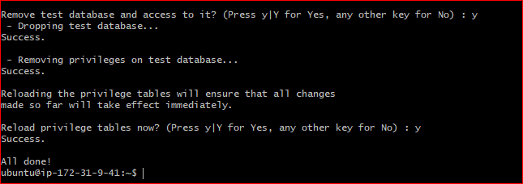
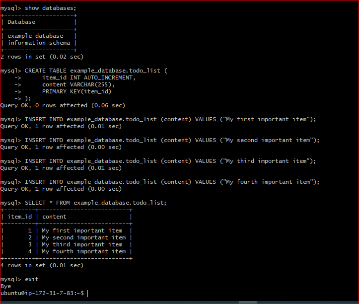

# PROJECT-2 [WEB STACK IMPLEMENTATION (LEMP STACK)]
## *Step 0 

–Preparing prerequisites

-AWS accound and EC2 instance ready

-GitBash downloaded and installed

`ssh -i <Your-private-key.pem> ubuntu@<EC2-Public-IP-address>`

## *STEP 1 
 
–INSTALLING THE NGINX WEB SERVER

-install Nginx

`sudo apt update`

`sudo apt install nginx`

`sudo systemctl status nginx`

`curl http://localhost:80`

- open http://<Public-IP-Address>:80 through any browser

`curl -s http://169.254.169.254/latest/meta-data/public-ipv4`

## STEP 2 

—INSTALLING MYSQL
`sudo apt install mysql-server`

`sudo mysql_secure_installation`

`sudo mysql`

`exit`

## STEP 3 

–INSTALLING PHP

`sudo apt install php-fpm php-mysql`

## STEP 4 

—CONFIGURING NGINX TO USE PHP PROCESSOR

`sudo mkdir /var/www/projectLEMP`

`sudo chown -R $USER:$USER /var/www/projectLEMP`

`sudo nano /etc/nginx/sites-available/projectLEMP`

-included the file below

/etc/nginx/sites-available/projectLEMP

server {
    listen 80;
    server_name projectLEMP www.projectLEMP;
    root /var/www/projectLEMP;

    index index.html index.htm index.php;

    location / {
        try_files $uri $uri/ =404;
    }

    location ~ \.php$ {
        include snippets/fastcgi-php.conf;
        fastcgi_pass unix:/var/run/php/php7.4-fpm.sock;
     }

    location ~ /\.ht {
        deny all;
    }
}
`sudo ln -s /etc/nginx/sites-available/projectLEMP /etc/nginx/sites-enabled/`

`sudo nginx -t`

`sudo unlink /etc/nginx/sites-enabled/default`

`sudo systemctl reload nginx`

`sudo echo 'Hello LEMP from hostname' $(curl -s http://169.254.169.254/latest/meta-data/public-hostname) 'with public IP' $(curl -s http://169.254.169.254/latest/meta-data/public-ipv4) > /var/www/projectLEMP/index.html`

open http://<Public-IP-Address>:80 through browser

## STEP 5 
–TESTING PHP WITH NGINX

`sudo nano /var/www/projectLEMP/info.php`

-Insert the file below

[<?php
phpinfo();]

Open http://ec2-54-193-68-224.us-west-1.compute.amazonaws.com/info.php in any browser

## STEP 6

–RETRIEVING DATA FROM MYSQL DATABASE WITH PHP

`sudo mysql`

`mysql> CREATE DATABASE example_database;`

`(CREATE USER 'example_user'@'%' IDENTIFIED WITH mysql_native_password BY 'password';)`

`GRANT ALL ON example_database.* TO 'example_user'@'%';`

`exit`

`mysql -u example_user -p`

`SHOW DATABASES;`

`(CREATE TABLE example_database.todo_list ( item_id INT AUTO_INCREMENT,  content VARCHAR(255),  PRIMARY KEY(item_id));)`

`INSERT INTO example_database.todo_list (content) VALUES ("My first important item");`

`SELECT * FROM example_database.todo_list;`

` exit`

`nano /var/www/projectLEMP/todo_list.php`

-Copy the below content into your todo_list.php script:

[<?php
$user = "example_user";
$password = "password";
$database = "example_database";
$table = "todo_list";]

`[try {
  $db = new PDO("mysql:host=localhost;dbname=$database", $user, $password);
  echo "<h2>TODO</h2><ol>";
  foreach($db->query("SELECT content FROM $table") as $row) {
    echo "<li>" . $row['content'] . "</li>";
  }
  echo "</ol>";
} catch (PDOException $e) {
    print "Error!: " . $e->getMessage() . " ";
    die();
}]`

-open http://<Public_domain_or_IP>/todo_list.php

# END OF PROJECT-2 
