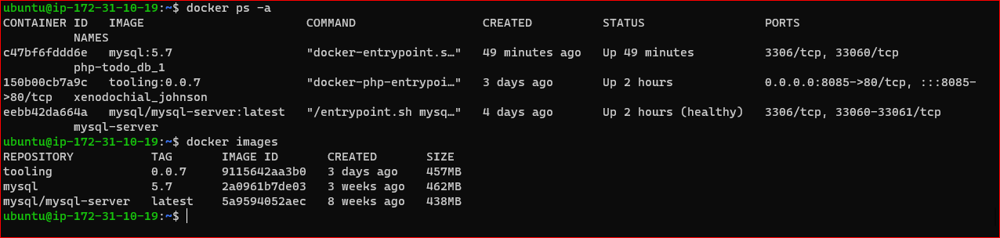

# MIGRATION TO THE CLOUD AND CONTAINERIZATION PART 1: DOCKER AND DOCKER COMPOSE

## Install Docker and Prepare for Migration to the Cloud
- Spin up an Ubuntu t2.medium instance
- Paste in the following block of code in the terminal
  ```
  curl -fsSL https://get.docker.com -o get-docker.sh
  sh ./get-docker.sh
  usermod -aG docker ubuntu
  ```
## MySQL in Container
- Pull MySQL Docker image from Docker Hub
  ```
  docker pull mysql/mysql-server:latest
  ```
  
  To list the images you have on your instance, type 
  
  `docker image ls`

- Deploy the MySQL Container
  ```
  docker run --name mysql -e MYSQL_ROOT_PASSWORD=adminPassword -d mysql/mysql-server:latest
  ```
 ** You can change the **name** and **password** flags to suit your preference.
  
  - Run `docker ps -a` to see all your containers (running or stopped)
  
## Connecting to the MySQL Docker container
- First approach (Connecting directly)
  ```
  docker exec -it  mysql -u root -p
  ```
  
- Second approach
  - stop and remove previously created container
  ```
  docker ps -a 
  docker stop mysql 
  docker rm mysql or <container ID> 
  ```
  - Create a network
    ```
    docker network create --subnet=172.18.0.0/24 tooling_app_network
    ```
  - Export an environment variable containing the root password setup earlier
    ```
    export MYSQL_PW=adminPassword
    echo $MYSQL_PW
    ```
  - Run the container using the network created
    ```
    docker run --network tooling_app_network -h mysqlserverhost --name=mysql-server -e MYSQL_ROOT_PASSWORD=$MYSQL_PW  -d mysql/mysql-server:latest
    ```
- Create a MySQL user using a script
  - Create a **create_user.sql** file and paste in the following
    ```sql
    CREATE USER 'user'@'%' IDENTIFIED BY 'password'; GRANT ALL PRIVILEGES ON * . * TO 'user'@'%';
    ```
  - note that the "password" is the password for "user" to connect to mysql
  - Run the script
    ```sh
    docker exec -i mysql-server mysql -uroot -p$MYSQL_PW < ./create_user.sql
    ```
- note that the error message "mysql: [Warning] Using a password on the command line interface can be insecure" is accepted. 

- Run the MySQL client container
  ```
  docker run --network tooling_app_network --name mysql-client -it --rm mysql mysql -h mysqlserverhost -u user -p 
  ```
- the above is to confirm if newly created mysql user can connect to mysql server


## Prepare Database Schema
- Clone the Tooling app repository
  ```
  git clone https://github.com/darey-devops/tooling.git
  ```
- Export the location of the SQL file
  ```
  export tooling_db_schema=./tooling/html/tooling_db_schema.sql
  ```
- Use the script to create the database and prepare the schema
  ```
  docker exec -i mysql-server mysql -u root -p $MYSQL_PW < $tooling_db_schema
  ```
- Update *db_conn.php* file with database information
  ```
   $servername = "mysqlserverhost"; $username = "user"; $password = "password"; $dbname = "toolingdb"; 
   ```
- Run the Tooling app
  - First build the Docker image. Cd into the tooling folder, where the Dockerfile is and run
    ```
    docker build -t tooling:0.0.1 .
    ```
  - Run the container
    ```
    docker run --network tooling_app_network -p 8085:80 -it tooling:0.0.1
    ```
    
  - open port 8085 and access http://public-ip:8085  
    

## Practice Task 1
### Implement a POC to migrate the PHP-Todo app into a containerized application.
### Part 1
- Clone the php-todo repo here: https://github.com/donhasmo/php-todo.git 
- Write a Dockerfile for the TODO application
```
FROM php:7.4.30-apache

USER root
WORKDIR  /var/www/html

RUN apt-get update && apt-get install -y \
    libpng-dev \
    zlib1g-dev \
    libxml2-dev \
    libzip-dev \
    libonig-dev \
    zip \
    curl \
    unzip \
    && docker-php-ext-configure gd \
    && docker-php-ext-install -j$(nproc) gd \
    && docker-php-ext-install pdo_mysql \
    && docker-php-ext-install mysqli \
    && docker-php-ext-install zip \
    && docker-php-source delete

COPY . .

RUN curl -sS https://getcomposer.org/installer | php -- --install-dir=/usr/local/bin --filename=composer

RUN chown -R www-data:www-data /var/www/html \
    && a2enmod rewrite

ENV PORT=8000

ENTRYPOINT [  "bash", "start-apache.sh" ]
```
  the start-apache.sh file should contain the following block:
  ```
  #!/bin/bash

composer install  --no-interaction
composer update --no-interaction
php artisan migrate 
php artisan key:generate 
php artisan serve  --host=0.0.0.0
  ```
- Run both database and app on your Docker Engine
  ```
  docker build -t php:0.0.1 .
  docker run --network tooling_app_network -p 8000:8000 -it php:0.0.1
  ```
- Open port 8000 and access the application from the browser
  
  

### Part 2
- Create an account on Docker Hub
  
- Create a Docker Hub repository
 
  
- Push the docker images from the instance to Docker Hub
  - First run `docker login` and enter your docker credentials.
  - Then retag your image and push:
    ```
    docker tag php:0.0.1 hasmo/php:0.0.1
    docker push hasmo/php:0.0.1
    ```
  
  

### Part 3
- Write a Jenkinsfile for Docker build and push to registry
```
 pipeline {
    agent any

    stages {

        stage('Initial Cleanup') {
            steps {
            dir("${WORKSPACE}") {
              deleteDir()
            }
          }
        }

        stage ('Checkout Repo'){
            steps {
            git branch: 'main', url: 'https://github.com/donhasmo/php-todo.git'
          }
    }

        stage ('Build Docker Image') {
            steps {
                script {

                       sh "docker build -t hasmo/php:${env.BRANCH_NAME}-${env.BUILD_NUMBER} ."
                }
            }
        }
        stage ('Push Docker Image') {
             
             steps{
                 script {
             sh "docker login -u ${env.username} -p ${env.password}"

             sh "docker push hasmo/php:${env.BRANCH_NAME}-${env.BUILD_NUMBER}"
             }
           }
         }
    }
}
```
- Connect the repo to Jenkins (using Blue Ocean plugin)
- Create a multibranch pipeline
- Make sure you configure your environment variables in Jenkins,configure system (global properties) and also create a global certificate with the ID, username and password (or access token)  
- Simulate a Docker push
  
  
- Verify the images can be found in the registry
  

### Deployment with Docker Compose
- Install Docker Compose (https://docs.docker.com/compose/install/)
- verify installation `docker-compose --version`
1[](./images/compose-verify.PNG)
- Create a file, `tooling.yaml` and paste in the following block
  ```
  version: "3.9"
  services:
  tooling_frontend:
    build: .
    ports:
      - "5000:80"
    volumes:
      - tooling_frontend:/var/www/html
    links:
      - db
  db:
    image: mysql:5.7
    restart: always
    environment:
      MYSQL_DATABASE: <The database name required by Tooling app >
      MYSQL_USER: <The user required by Tooling app >
      MYSQL_PASSWORD: <The password required by Tooling app >
      MYSQL_RANDOM_ROOT_PASSWORD: '1'
    volumes:
      - db:/var/lib/mysql
  volumes:
    tooling_frontend:
    db:
    ```
- Run the command `docker-compose -f tooling.yaml up -d` to start the containers.
- Verify the containers are running `docker-compose -f tooling.yaml ps`

## Practice Task 2
### 1. Document understanding of the various fields in `tooling.yaml`
- version: "3.9" specifies the version of the docker-compose API 
- services: defines configurations that are applied to containers when `docker-compose up` is run. 
  - tooling_frontend specifies the name of the first service.
  - build tells docker-compose that it needs to build and image from a Dockerfile for this service.
  - ports attaches port 5000 on the instance to port 80 on the container
  - volumes attaches a path on the host instance to any container created for the service
  - links connects one container to another (tooling_frontend to db in this case)
  - db defines the database service (can be any name)
  - image specifies the image to use for the containers, if it isn't available on the instance, it is pulled from Docker Hub
  - restart tells the container how frequently to restart
  - environment is used to pass environment variables required for the service running in the container


### 2. Update Jenkinsfile with a test stage
- Add the following after the **Build Image** stage in your Jenkinsfile for php-todo
```
       stage("Start the app") {
            steps {
                sh "docker-compose up -d"
            }
        }
        stage ('Test endpoint') {
            steps {
                script {

                     sh "sleep 10"
                     sh "curl -i 50.112.225.144:8000"
                }
            }
        }

        // stage ('Push Docker Image') {
        //     when { expression { response.status == 200 } }
        //     steps{
        //         script {
        //     sh "docker login -u ${env.username} -p ${env.password}"

        //     sh "docker push hasmo/php:${env.BRANCH_NAME}-${env.BUILD_NUMBER}"
        //     }
        //   }
        // }

        

        stage ("Remove images") {
            steps {
                sh "docker-compose down"
                sh "docker system prune -af"
            }
        }
    }
}

```
  The "Test endpoint" stage uses httpRequest to check if the app can be reached after running `docker-compose up -d`.


- Run `docker images` to see if images are deleted.


## Blocker
When you get an error about filled up space, you have to increase EBS volume size.

Link to php-todo repo: https://github.com/donhasmo/php-todo