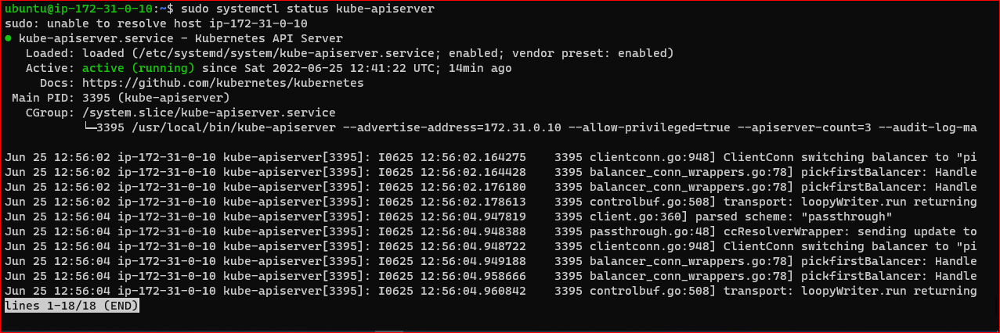

# K8s From Grounds Up


## Install Client Tools
Tools:
- awscli: Tool used to manage AWS resources
  ```
  Installation: https://aws.amazon.com/cli/
  ```
- kubectl: Used to manage K8s cluster
  ```
  wget https://storage.googleapis.com/kubernetes-release/release/v1.21.0/bin/linux/amd64/kubectl
  chmod +x kubectl
  sudo mv kubectl /usr/local/bin/
  kubectl version --client
  ```
- cfssl: an open source toolkit for everything TLS/SSL from Cloudflare

- cfssljson – a program, which takes the JSON output from the cfssl and writes certificates, keys, CSRs, and bundles to disk.
  ```
  wget -q --show-progress --https-only --timestamping \
  https://storage.googleapis.com/kubernetes-the-hard-way/cfssl/1.4.1/linux/cfssl \
  https://storage.googleapis.com/kubernetes-the-hard-way/cfssl/1.4.1/linux/cfssljson
  chmod +x cfssl cfssljson
  sudo mv cfssl cfssljson /usr/local/bin/
  ```

## AWS Resources for K8s Cluster
- VPC (172.31.0.0/16 CIDR block)
```
VPC_ID=$(aws ec2 create-vpc \
--cidr-block 172.31.0.0/16 \
--output text --query 'Vpc.VpcId'
)
```
```
NAME=k8s-cluster-from-ground-up

aws ec2 create-tags \
  --resources ${VPC_ID} \
  --tags Key=Name,Value=${NAME}
```
  - Enable DNS support
```
aws ec2 modify-vpc-attribute \
--vpc-id ${VPC_ID} \
--enable-dns-support '{"Value": true}'
```
  - Enable DNS hostnames
```
aws ec2 modify-vpc-attribute \
--vpc-id ${VPC_ID} \
--enable-dns-hostnames '{"Value": true}'
```  
  - DHCP option sets
```
DHCP_OPTION_SET_ID=$(aws ec2 create-dhcp-options \
  --dhcp-configuration \
    "Key=domain-name,Values=$AWS_REGION.compute.internal" \
    "Key=domain-name-servers,Values=AmazonProvidedDNS" \
  --output text --query 'DhcpOptions.DhcpOptionsId')
```  
```
aws ec2 create-tags \
  --resources ${DHCP_OPTION_SET_ID} \
  --tags Key=Name,Value=${NAME}
```
  - Associate the DHCP Option set with the VPC:
```
aws ec2 associate-dhcp-options \
  --dhcp-options-id ${DHCP_OPTION_SET_ID} \
  --vpc-id ${VPC_ID}
```  
  - Subnet (172.31.0.0/24 CIDR block)
```
SUBNET_ID=$(aws ec2 create-subnet \
  --vpc-id ${VPC_ID} \
  --cidr-block 172.31.0.0/24 \
  --output text --query 'Subnet.SubnetId')
```
```
aws ec2 create-tags \
  --resources ${SUBNET_ID} \
  --tags Key=Name,Value=${NAME}
```  
  - Internet Gateway
```
INTERNET_GATEWAY_ID=$(aws ec2 create-internet-gateway \
  --output text --query 'InternetGateway.InternetGatewayId')
aws ec2 create-tags \
  --resources ${INTERNET_GATEWAY_ID} \
  --tags Key=Name,Value=${NAME}
```
```
aws ec2 attach-internet-gateway \
  --internet-gateway-id ${INTERNET_GATEWAY_ID} \
  --vpc-id ${VPC_ID}
```  
  - Route table with route to the internet gateway
```
ROUTE_TABLE_ID=$(aws ec2 create-route-table \
  --vpc-id ${VPC_ID} \
  --output text --query 'RouteTable.RouteTableId')
aws ec2 create-tags \
  --resources ${ROUTE_TABLE_ID} \
  --tags Key=Name,Value=${NAME}
aws ec2 associate-route-table \
  --route-table-id ${ROUTE_TABLE_ID} \
  --subnet-id ${SUBNET_ID}
aws ec2 create-route \
  --route-table-id ${ROUTE_TABLE_ID} \
  --destination-cidr-block 0.0.0.0/0 \
  --gateway-id ${INTERNET_GATEWAY_ID}
```  
  - Security groups
```
# Create the security group and store its ID in a variable
SECURITY_GROUP_ID=$(aws ec2 create-security-group \
  --group-name ${NAME} \
  --description "Kubernetes cluster security group" \
  --vpc-id ${VPC_ID} \
  --output text --query 'GroupId')

# Create the NAME tag for the security group
aws ec2 create-tags \
  --resources ${SECURITY_GROUP_ID} \
  --tags Key=Name,Value=${NAME}

# Create Inbound traffic for all communication within the subnet to connect on ports used by the master node(s)
aws ec2 authorize-security-group-ingress \
    --group-id ${SECURITY_GROUP_ID} \
    --ip-permissions IpProtocol=tcp,FromPort=2379,ToPort=2380,IpRanges='[{CidrIp=172.31.0.0/24}]'

# # Create Inbound traffic for all communication within the subnet to connect on ports used by the worker nodes
aws ec2 authorize-security-group-ingress \
    --group-id ${SECURITY_GROUP_ID} \
    --ip-permissions IpProtocol=tcp,FromPort=30000,ToPort=32767,IpRanges='[{CidrIp=172.31.0.0/24}]'

# Create inbound traffic to allow connections to the Kubernetes API Server listening on port 6443
aws ec2 authorize-security-group-ingress \
  --group-id ${SECURITY_GROUP_ID} \
  --protocol tcp \
  --port 6443 \
  --cidr 0.0.0.0/0

# Create Inbound traffic for SSH from anywhere (Do not do this in production. Limit access ONLY to IPs or CIDR that MUST connect)
aws ec2 authorize-security-group-ingress \
  --group-id ${SECURITY_GROUP_ID} \
  --protocol tcp \
  --port 22 \
  --cidr 0.0.0.0/0

# Create ICMP ingress for all types
aws ec2 authorize-security-group-ingress \
  --group-id ${SECURITY_GROUP_ID} \
  --protocol icmp \
  --port -1 \
  --cidr 0.0.0.0/0
```  
    - Allow ports 2379-2380 from within the subnet
    - Allow ports 30000-32767 from anywhere (to access cluster services)
    - Allow port 6443 for K8s API server
    - Allow SSH connection from anywhere
    - Allow ICMP Rule
- Network load balancer
```
LOAD_BALANCER_ARN=$(aws elbv2 create-load-balancer \
--name ${NAME} \
--subnets ${SUBNET_ID} \
--scheme internet-facing \
--type network \
--output text --query 'LoadBalancers[].LoadBalancerArn')
```
  - Target group
   - Protocol: TCP
    - Port: 6443
```
TARGET_GROUP_ARN=$(aws elbv2 create-target-group \
  --name ${NAME} \
  --protocol TCP \
  --port 6443 \
  --vpc-id ${VPC_ID} \
  --target-type ip \
  --output text --query 'TargetGroups[].TargetGroupArn')
```  
  - Register Targets
```
aws elbv2 register-targets \
  --target-group-arn ${TARGET_GROUP_ARN} \
  --targets Id=172.31.0.1{0,1,2}
```  
   
  - ELB listener
```
aws elbv2 create-listener \
--load-balancer-arn ${LOAD_BALANCER_ARN} \
--protocol TCP \
--port 6443 \
--default-actions Type=forward,TargetGroupArn=${TARGET_GROUP_ARN} \
--output text --query 'Listeners[].ListenerArn'
```  
    - Protocol: TCP
    - Port: 6443
    - Default actions: forward to target group
- Create 3 master nodes and 3 worker nodes (disable source-dest checks)
  - Get kubernetes public address
```
KUBERNETES_PUBLIC_ADDRESS=$(aws elbv2 describe-load-balancers \
--load-balancer-arns ${LOAD_BALANCER_ARN} \
--output text --query 'LoadBalancers[].DNSName')
```  
## Create Compute Resources
- Get an image to create EC2 instances:
```
IMAGE_ID=$(aws ec2 describe-images --owners 099720109477 \
  --filters \
  'Name=root-device-type,Values=ebs' \
  'Name=architecture,Values=x86_64' \
  'Name=name,Values=ubuntu/images/hvm-ssd/ubuntu-xenial-16.04-amd64-server-*' \
  | jq -r '.Images|sort_by(.Name)[-1]|.ImageId')
```
- Create SSH Key-Pair
```
mkdir -p ssh

aws ec2 create-key-pair \
  --key-name ${NAME} \
  --output text --query 'KeyMaterial' \
  > ssh/${NAME}.id_rsa
chmod 600 ssh/${NAME}.id_rsa
```
 ## EC2 Instances for Controle Plane (Master Nodes)
 - Create 3 Master nodes
 ```
 for i in 0 1 2; do
  instance_id=$(aws ec2 run-instances \
    --associate-public-ip-address \
    --image-id ${IMAGE_ID} \
    --count 1 \
    --key-name ${NAME} \
    --security-group-ids ${SECURITY_GROUP_ID} \
    --instance-type t2.micro \
    --private-ip-address 172.31.0.1${i} \
    --user-data "name=master-${i}" \
    --subnet-id ${SUBNET_ID} \
    --output text --query 'Instances[].InstanceId')
  aws ec2 modify-instance-attribute \
    --instance-id ${instance_id} \
    --no-source-dest-check
  aws ec2 create-tags \
    --resources ${instance_id} \
    --tags "Key=Name,Value=${NAME}-master-${i}"
done
 ```
- Create 3 worker nodes:
```
for i in 0 1 2; do
  instance_id=$(aws ec2 run-instances \
    --associate-public-ip-address \
    --image-id ${IMAGE_ID} \
    --count 1 \
    --key-name ${NAME} \
    --security-group-ids ${SECURITY_GROUP_ID} \
    --instance-type t2.micro \
    --private-ip-address 172.31.0.2${i} \
    --user-data "name=worker-${i}|pod-cidr=172.20.${i}.0/24" \
    --subnet-id ${SUBNET_ID} \
    --output text --query 'Instances[].InstanceId')
  aws ec2 modify-instance-attribute \
    --instance-id ${instance_id} \
    --no-source-dest-check
  aws ec2 create-tags \
    --resources ${instance_id} \
    --tags "Key=Name,Value=${NAME}-worker-${i}"
done
``` 
 
  
## Prepare Self Signed CA and generate TLS Certificates
- Create ca-authority directory

`mkdir ca-authority && cd ca-authority`

- Generate the CA configuration file, root certificate and private key
```
{

cat > ca-config.json <<EOF
{
  "signing": {
    "default": {
      "expiry": "8760h"
    },
    "profiles": {
      "kubernetes": {
        "usages": ["signing", "key encipherment", "server auth", "client auth"],
        "expiry": "8760h"
      }
    }
  }
}
EOF

cat > ca-csr.json <<EOF
{
  "CN": "Kubernetes",
  "key": {
    "algo": "rsa",
    "size": 2048
  },
  "names": [
    {
      "C": "UK",
      "L": "England",
      "O": "Kubernetes",
      "OU": "DAREY.IO DEVOPS",
      "ST": "London"
    }
  ]
 }
 EOF

 cfssl gencert -initca ca-csr.json | cfssljson -bare ca

 }
```
- Generate the Certificate Signing Request (CSR), Private Key and the Certificate for the Kubernetes Master Nodes
```
 {
  cat > master-kubernetes-csr.json <<EOF
 {
  "CN": "kubernetes",
   "hosts": [
   "127.0.0.1",
   "172.31.0.10",
   "172.31.0.11",
   "172.31.0.12",
   "ip-172-31-0-10",
   "ip-172-31-0-11",
   "ip-172-31-0-12",
   "ip-172-31-0-10.${AWS_REGION}.compute.internal",
   "ip-172-31-0-11.${AWS_REGION}.compute.internal",
   "ip-172-31-0-12.${AWS_REGION}.compute.internal",
   "${KUBERNETES_PUBLIC_ADDRESS}",
   "kubernetes",
   "kubernetes.default",
   "kubernetes.default.svc",
   "kubernetes.default.svc.cluster",
   "kubernetes.default.svc.cluster.local"
  ],
  "key": {
    "algo": "rsa",
    "size": 2048
  },
  "names": [
    {
      "C": "UK",
      "L": "England",
      "O": "Kubernetes",
      "OU": "DAREY.IO DEVOPS",
      "ST": "London"
    }
  ]
 }
 EOF

 cfssl gencert \
  -ca=ca.pem \
  -ca-key=ca-key.pem \
  -config=ca-config.json \
  -profile=kubernetes \
  master-kubernetes-csr.json | cfssljson -bare master-kubernetes
}
```
- kube-scheduler Client Certificate and Private Key
```
{

cat > kube-scheduler-csr.json <<EOF
{
  "CN": "system:kube-scheduler",
  "key": {
    "algo": "rsa",
    "size": 2048
  },
  "names": [
    {
      "C": "UK",
      "L": "England",
      "O": "system:kube-scheduler",
      "OU": "DAREY.IO DEVOPS",
      "ST": "London"
    }
  ]
 }
 EOF

 cfssl gencert \
  -ca=ca.pem \
  -ca-key=ca-key.pem \
  -config=ca-config.json \
  -profile=kubernetes \
  kube-scheduler-csr.json | cfssljson -bare kube-scheduler

}
```
- kube-controller-manager Client Certificate and Private Key
```
 {
cat > kube-controller-manager-csr.json <<EOF
{
  "CN": "system:kube-controller-manager",
  "key": {
    "algo": "rsa",
    "size": 2048
  },
  "names": [
    {
      "C": "UK",
      "L": "England",
      "O": "system:kube-controller-manager",
      "OU": "DAREY.IO DEVOPS",
      "ST": "London"
    }
  ]
}
EOF

cfssl gencert \
  -ca=ca.pem \
  -ca-key=ca-key.pem \
  -config=ca-config.json \
  -profile=kubernetes \
  kube-controller-manager-csr.json | cfssljson -bare kube-controller-manager

}
```
- kube-proxy Client Certificate and Private Key
```
 
kube-proxy Client Certificate and Private Key
{

cat > kube-proxy-csr.json <<EOF
{
  "CN": "system:kube-proxy",
  "key": {
    "algo": "rsa",
    "size": 2048
  },
  "names": [
    {
      "C": "UK",
      "L": "England",
      "O": "system:node-proxier",
      "OU": "DAREY.IO DEVOPS",
      "ST": "London"
    }
  ]
}
EOF

cfssl gencert \
  -ca=ca.pem \
  -ca-key=ca-key.pem \
  -config=ca-config.json \
  -profile=kubernetes \
  kube-proxy-csr.json | cfssljson -bare kube-proxy

}
```
- kubelet Client Certificate and Private Key
```
 for i in 0 1 2; do
  instance="${NAME}-worker-${i}"
  instance_hostname="ip-172-31-0-2${i}"
  cat > ${instance}-csr.json <<EOF
{
  "CN": "system:node:${instance_hostname}",
  "key": {
    "algo": "rsa",
    "size": 2048
  },
  "names": [
    {
      "C": "UK",
      "L": "England",
      "O": "system:nodes",
      "OU": "DAREY.IO DEVOPS",
      "ST": "London"
    }
  ]
}
EOF

  external_ip=$(aws ec2 describe-instances \
    --filters "Name=tag:Name,Values=${instance}" \
    --output text --query 'Reservations[].Instances[].PublicIpAddress')

  internal_ip=$(aws ec2 describe-instances \
    --filters "Name=tag:Name,Values=${instance}" \
    --output text --query 'Reservations[].Instances[].PrivateIpAddress')

  cfssl gencert \
    -ca=ca.pem \
    -ca-key=ca-key.pem \
    -config=ca-config.json \
    -hostname=${instance_hostname},${external_ip},${internal_ip} \
    -profile=kubernetes \
    ${NAME}-worker-${i}-csr.json | cfssljson -bare ${NAME}-worker-${i}
done
```
- Admin user Certificate and Private Key
```
 {
cat > admin-csr.json <<EOF
{
  "CN": "admin",
  "key": {
    "algo": "rsa",
    "size": 2048
  },
  "names": [
    {
      "C": "UK",
      "L": "England",
      "O": "system:masters",
      "OU": "DAREY.IO DEVOPS",
      "ST": "London"
    }
  ]
}
EOF

cfssl gencert \
  -ca=ca.pem \
  -ca-key=ca-key.pem \
  -config=ca-config.json \
  -profile=kubernetes \
  admin-csr.json | cfssljson -bare admin
}
```
- Service account certificate and private key
```
 {

cat > service-account-csr.json <<EOF
{
  "CN": "service-accounts",
  "key": {
    "algo": "rsa",
    "size": 2048
  },
  "names": [
    {
      "C": "UK",
      "L": "England",
      "O": "Kubernetes",
      "OU": "DAREY.IO DEVOPS",
      "ST": "London"
    }
  ]
}
EOF

cfssl gencert \
  -ca=ca.pem \
  -ca-key=ca-key.pem \
  -config=ca-config.json \
  -profile=kubernetes \
  service-account-csr.json | cfssljson -bare service-account
}
```
  
## Distribute the client and server certificates
- Copy specific worker node keys to the respective worker nodes

- Copy kube-proxy, kubelet and ca.pem to all worker nodes
```
 for i in 0 1 2; do
  instance="${NAME}-worker-${i}"
  external_ip=$(aws ec2 describe-instances \
    --filters "Name=tag:Name,Values=${instance}" \
    --output text --query 'Reservations[].Instances[].PublicIpAddress')
  scp -i ../ssh/${NAME}.id_rsa \
ca.pem ${instance}-key.pem ${instance}.pem ubuntu@${external_ip}:~/; \
  done  
```
NB: - make sure you're in the ssh directory.
    
- Copy ca.pem, ca-key.pem, service-account* and master-kubernetes* to all master nodes
```
 for i in 0 1 2; do
  instance="${NAME}-master-${i}"
  external_ip=$(aws ec2 describe-instances \
    --filters "Name=tag:Name,Values=${instance}" \
    --output text --query 'Reservations[].Instances[].PublicIpAddress')
  scp -i ../ssh/${NAME}.id_rsa \
master-kubernetes.pem master-kubernetes-key.pem ubuntu@${external_ip}:~/; \
  done
```

## Generate K8s configuration files with kubectl
- Generate configuration files for individual worker instances. Create the environment variables below

```
 KUBERNETES_API_SERVER_ADDRESS=$(aws elbv2 describe-load-balancers --load-balancer-arns ${LOAD_BALANCER_ARN} --output text --query 'LoadBalancers[].DNSName')
```

- Generate the kube-proxy kubeconfig
```
 {
  kubectl config set-cluster ${NAME} \
    --certificate-authority=ca.pem \
    --embed-certs=true \
    --server=https://${KUBERNETES_API_SERVER_ADDRESS}:6443 \
    --kubeconfig=kube-proxy.kubeconfig

  kubectl config set-credentials system:kube-proxy \
    --client-certificate=kube-proxy.pem \
    --client-key=kube-proxy-key.pem \
    --embed-certs=true \
    --kubeconfig=kube-proxy.kubeconfig

  kubectl config set-context default \
    --cluster=${NAME} \
    --user=system:kube-proxy \
    --kubeconfig=kube-proxy.kubeconfig

  kubectl config use-context default --kubeconfig=kube-proxy.kubeconfig
}
```
- Generate the kubeconfig file for cluster administrator
```
 for i in 0 1 2; do

instance="${NAME}-worker-${i}"
instance_hostname="ip-172-31-0-2${i}"

 # Set the kubernetes cluster in the kubeconfig file
  kubectl config set-cluster ${NAME} \
    --certificate-authority=ca.pem \
    --embed-certs=true \
    --server=https://$KUBERNETES_API_SERVER_ADDRESS:6443 \
    --kubeconfig=${instance}.kubeconfig

# Set the cluster credentials in the kubeconfig file
  kubectl config set-credentials system:node:${instance_hostname} \
    --client-certificate=${instance}.pem \
    --client-key=${instance}-key.pem \
    --embed-certs=true \
    --kubeconfig=${instance}.kubeconfig

# Set the context in the kubeconfig file
  kubectl config set-context default \
    --cluster=${NAME} \
    --user=system:node:${instance_hostname} \
    --kubeconfig=${instance}.kubeconfig

  kubectl config use-context default --kubeconfig=${instance}.kubeconfig
done
```
- Generate the kube-controller-manager kubeconfig
```
{
  kubectl config set-cluster ${NAME} \
    --certificate-authority=ca.pem \
    --embed-certs=true \
    --server=https://127.0.0.1:6443 \
    --kubeconfig=kube-controller-manager.kubeconfig

  kubectl config set-credentials system:kube-controller-manager \
    --client-certificate=kube-controller-manager.pem \
    --client-key=kube-controller-manager-key.pem \
    --embed-certs=true \
    --kubeconfig=kube-controller-manager.kubeconfig

  kubectl config set-context default \
    --cluster=${NAME} \
    --user=system:kube-controller-manager \
    --kubeconfig=kube-controller-manager.kubeconfig

  kubectl config use-context default --kubeconfig=kube-controller-manager.kubeconfig
}
```
- Generate the kube-scheduler kubeconfig
```
 {
  kubectl config set-cluster ${NAME} \
    --certificate-authority=ca.pem \
    --embed-certs=true \
    --server=https://127.0.0.1:6443 \
    --kubeconfig=kube-scheduler.kubeconfig

  kubectl config set-credentials system:kube-scheduler \
    --client-certificate=kube-scheduler.pem \
    --client-key=kube-scheduler-key.pem \
    --embed-certs=true \
    --kubeconfig=kube-scheduler.kubeconfig

  kubectl config set-context default \
    --cluster=${NAME} \
    --user=system:kube-scheduler \
    --kubeconfig=kube-scheduler.kubeconfig

  kubectl config use-context default --kubeconfig=kube-scheduler.kubeconfig
}
```

- Copy kube-controller and kube-scheduler files to all master nodes, kube-proxy and individual worker node kubeconfig files to the worker nodes
```
 for i in 0; do
  instance="${NAME}-worker-${i}"
  external_ip=$(aws ec2 describe-instances \
    --filters "Name=tag:Name,Values=${instance}" \
    --output text --query 'Reservations[].Instances[].PublicIpAddress')
  scp -i ../ssh/${NAME}.id_rsa \
kube-proxy.kubeconfig k8s-cluster-from-ground-up-worker-${i}.kubeconfig ubuntu@${external_ip}:~/; \
  done  
```
- repeat for i in 1&2.
```
 for i in 0 1 2; do
  instance="${NAME}-master-${i}"
  external_ip=$(aws ec2 describe-instances \
    --filters "Name=tag:Name,Values=${instance}" \
    --output text --query 'Reservations[].Instances[].PublicIpAddress')
  scp -i ../ssh/${NAME}.id_rsa \
admin.kubeconfig kube-controller-manager.kubeconfig kube-scheduler.kubeconfig ubuntu@${external_ip}:~/; \
  done
```

  
## Prepare ETCD database for encryption at res
- Generate the encryption key and encode it using base 32
```
ETCD_ENCRYPTION_KEY=$(head -c 32 /dev/urandom | base64)
```
NB:- ETCD encryption should be 32 bytes 
- Create encyption-config.yaml file
```
 cat > encryption-config.yaml <<EOF
kind: EncryptionConfig
apiVersion: v1
resources:
  - resources:
      - secrets
    providers:
      - aescbc:
          keys:
            - name: key1
              secret: ${ETCD_ENCRYPTION_KEY}
      - identity: {}
EOF
```
- Send the encryption file to the Controller nodes using scp and a for loop
```
for i in 0 1 2; do
  instance="${NAME}-master-${i}"
  external_ip=$(aws ec2 describe-instances \
    --filters "Name=tag:Name,Values=${instance}" \
    --output text --query 'Reservations[].Instances[].PublicIpAddress')
  scp -i ../ssh/${NAME}.id_rsa \
encryption-config.yaml ubuntu@${external_ip}:~/; \
  done
```
## Bootstrap etcd cluster
- ssh into all master server (make sure you're in ssh directory and run same code for all all 3 master nodes)
```
 master_1_ip=$(aws ec2 describe-instances \
--filters "Name=tag:Name,Values=${NAME}-master-0" \
--output text --query 'Reservations[].Instances[].PublicIpAddress')
ssh -i k8s-cluster-from-ground-up.id_rsa ubuntu@${master_1_ip}
```
```
master_2_ip=$(aws ec2 describe-instances \
--filters "Name=tag:Name,Values=${NAME}-master-1" \
--output text --query 'Reservations[].Instances[].PublicIpAddress')
ssh -i k8s-cluster-from-ground-up.id_rsa ubuntu@${master_2_ip}
```
```
 master_3_ip=$(aws ec2 describe-instances \
--filters "Name=tag:Name,Values=${NAME}-master-2" \
--output text --query 'Reservations[].Instances[].PublicIpAddress')
ssh -i k8s-cluster-from-ground-up.id_rsa ubuntu@${master_3_ip}
```
- Download and install etcd
```
  wget -q --show-progress --https-only --timestamping \
  "https://github.com/etcd-io/etcd/releases/download/v3.4.15/etcd-v3.4.15-linux-amd64.tar.gz"
```
- Extract and install the etcd server and the etcdctl command line utility:
```
 
{
tar -xvf etcd-v3.4.15-linux-amd64.tar.gz
sudo mv etcd-v3.4.15-linux-amd64/etcd* /usr/local/bin/
}
```
- Configure the etcd server
```
{
  sudo mkdir -p /etc/etcd /var/lib/etcd
  sudo chmod 700 /var/lib/etcd
  sudo cp ca.pem master-kubernetes-key.pem master-kubernetes.pem /etc/etcd/
}
```
- export instance ip as variable
```
 export INTERNAL_IP=$(curl -s http://169.254.169.254/latest/meta-data/local-ipv4)
```
- Set ETCD name to instance IP for unique identification
```
ETCD_NAME=$(curl -s http://169.254.169.254/latest/user-data/ \
  | tr "|" "\n" | grep "^name" | cut -d"=" -f2)

echo ${ETCD_NAME}
``` 
- Create ETCD service systemd unit
```
 cat <<EOF | sudo tee /etc/systemd/system/etcd.service
[Unit]
Description=etcd
Documentation=https://github.com/coreos

[Service]
Type=notify
ExecStart=/usr/local/bin/etcd \\
  --name ${ETCD_NAME} \\
  --trusted-ca-file=/etc/etcd/ca.pem \\
  --peer-trusted-ca-file=/etc/etcd/ca.pem \\
  --peer-client-cert-auth \\
  --client-cert-auth \\
  --listen-peer-urls https://${INTERNAL_IP}:2380 \\
  --listen-client-urls https://${INTERNAL_IP}:2379,https://127.0.0.1:2379 \\
  --advertise-client-urls https://${INTERNAL_IP}:2379 \\
  --initial-cluster-token etcd-cluster-0 \\
  --initial-cluster master-0=https://172.31.0.10:2380,master-1=https://172.31.0.11:2380,master-2=https://172.31.0.12:2380 \\
  --cert-file=/etc/etcd/master-kubernetes.pem \\
  --key-file=/etc/etcd/master-kubernetes-key.pem \\
  --peer-cert-file=/etc/etcd/master-kubernetes.pem \\
  --peer-key-file=/etc/etcd/master-kubernetes-key.pem \\
  --initial-advertise-peer-urls https://${INTERNAL_IP}:2380 \\
  --initial-cluster-state new \\
  --data-dir=/var/lib/etcd
Restart=on-failure
RestartSec=5

[Install]
WantedBy=multi-user.target
EOF
```
- start service
```
 {
sudo systemctl daemon-reload
sudo systemctl enable etcd
sudo systemctl start etcd
}
```
- checke status `sudo systemctl status etcd`
  

## Bootstrap controlplane

- Create /etc/kubernetes/config directory
```
 sudo mkdir -p /etc/kubernetes/config
```
- Download and install kubectl, kube-apiserver, kube-scheduler and kube-controller-manager
- Configure each of the services
  
  
  

## Test current setup
```
kubectl cluster-info --kubeconfig admin.kubeconfig
```
```
kubectl get namespaces --kubeconfig admin.kubeconfig
```
```
curl --cacert /var/lib/kubernetes/ca.pem https://$INTERNAL_IP:6443/version
```


## Configuring the worker nodes
- Create and apply cluster role binding for kubelet
  ```
  cat <<EOF | kubectl apply --kubeconfig admin.kubeconfig -f -
    apiVersion: rbac.authorization.k8s.io/v1
    kind: ClusterRole
    metadata:
    annotations:
        rbac.authorization.kubernetes.io/autoupdate: "true"
    labels:
        kubernetes.io/bootstrapping: rbac-defaults
    name: system:kube-apiserver-to-kubelet
    rules:
    - apiGroups:
        - ""
        resources:
        - nodes/proxy
        - nodes/stats
        - nodes/log
        - nodes/spec
        - nodes/metrics
        verbs:
        - "*"
    EOF
  ```
  ```
  cat <<EOF | kubectl apply --kubeconfig admin.kubeconfig -f -
    apiVersion: rbac.authorization.k8s.io/v1
    kind: ClusterRoleBinding
    metadata:
    name: system:kube-apiserver
    namespace: ""
    roleRef:
    apiGroup: rbac.authorization.k8s.io
    kind: ClusterRole
    name: system:kube-apiserver-to-kubelet
    subjects:
    - apiGroup: rbac.authorization.k8s.io
        kind: User
        name: kubernetes
    EOF
  ```


- Install OS dependencies
NB: paste the custerRole and clusterRole Binding on your local machine or virtual machine on which you're working.
  ```
  {
  sudo apt-get update
  sudo apt-get -y install socat conntrack ipset
  }
  ```
- Disable swap
  ```
  sudo swapoff -a
  ```
- Download binaries for runc, crictl and containerd
  ```
   wget https://github.com/opencontainers/runc/releases/download/v1.0.0-rc93/runc.amd64 \
  https://github.com/kubernetes-sigs/cri-tools/releases/download/v1.21.0/crictl-v1.21.0-linux-amd64.tar.gz \
  https://github.com/containerd/containerd/releases/download/v1.4.4/containerd-1.4.4-linux-amd64.tar.gz 
  ```
- Configure containerd
  ```
  {
  mkdir containerd
  tar -xvf crictl-v1.21.0-linux-amd64.tar.gz
  tar -xvf containerd-1.4.4-linux-amd64.tar.gz -C containerd
  sudo mv runc.amd64 runc
  chmod +x  crictl runc  
  sudo mv crictl runc /usr/local/bin/
  sudo mv containerd/bin/* /bin/
  }
  ```
  `sudo mkdir -p /etc/containerd/`
  ```ini
  cat << EOF | sudo tee /etc/containerd/config.toml
    [plugins]
    [plugins.cri.containerd]
        snapshotter = "overlayfs"
        [plugins.cri.containerd.default_runtime]
        runtime_type = "io.containerd.runtime.v1.linux"
        runtime_engine = "/usr/local/bin/runc"
        runtime_root = ""
    EOF
  ```
  Create systemd service file for containerd
  ```ini
  cat <<EOF | sudo tee /etc/systemd/system/containerd.service
    [Unit]
    Description=containerd container runtime
    Documentation=https://containerd.io
    After=network.target

    [Service]
    ExecStartPre=/sbin/modprobe overlay
    ExecStart=/bin/containerd
    Restart=always
    RestartSec=5
    Delegate=yes
    KillMode=process
    OOMScoreAdjust=-999
    LimitNOFILE=1048576
    LimitNPROC=infinity
    LimitCORE=infinity

    [Install]
    WantedBy=multi-user.target
    EOF
  ```
  Create directories for to configure kubelet, kube-proxy, cni, and a directory to keep the kubernetes root ca file:
  ```
    sudo mkdir -p \
    /var/lib/kubelet \
    /var/lib/kube-proxy \
    /etc/cni/net.d \
    /opt/cni/bin \
    /var/lib/kubernetes \
    /var/run/kubernetes
  ```

- Download and install CNI
  ```
  wget -q --show-progress --https-only --timestamping \
  https://github.com/containernetworking/plugins/releases/download/v0.9.1/cni-plugins-linux-amd64-v0.9.1.tgz
  ```
  ```
  sudo tar -xvf cni-plugins-linux-amd64-v0.9.1.tgz -C /opt/cni/bin/
  ```
- Download binaries for kubelet, kubectl and kube-proxy
  ```
  wget -q --show-progress --https-only --timestamping \
  https://storage.googleapis.com/kubernetes-release/release/v1.21.0/bin/linux/amd64/kubectl \
  https://storage.googleapis.com/kubernetes-release/release/v1.21.0/bin/linux/amd64/kube-proxy \
  https://storage.googleapis.com/kubernetes-release/release/v1.21.0/bin/linux/amd64/kubelet
  ```
  Install binaries
  ```
  {
  chmod +x  kubectl kube-proxy kubelet  
  sudo mv  kubectl kube-proxy kubelet /usr/local/bin/
  }
  ```

## Configure Worker node components
- Configure bridge and loopback networks
  ```
  cat > 172-20-bridge.conf <<EOF
    {
        "cniVersion": "0.3.1",
        "name": "bridge",
        "type": "bridge",
        "bridge": "cnio0",
        "isGateway": true,
        "ipMasq": true,
        "ipam": {
            "type": "host-local",
            "ranges": [
            [{"subnet": "${POD_CIDR}"}]
            ],
            "routes": [{"dst": "0.0.0.0/0"}]
        }
    }
    EOF
  ```
  Loopback:
  ```
  cat > 99-loopback.conf <<EOF
    {
        "cniVersion": "0.3.1",
        "type": "loopback"
    }
    EOF
  ```

- Move files to network configuration directory
  ```
  sudo mv 172-20-bridge.conf 99-loopback.conf /etc/cni/net.d/
  ```

- Move the certificates and kubeconfig file to their respective configuration directories
- Create the kubelet-config.yaml file
- Configure kubelet and kube-proxy systemd service
  - Kubelet service
  
  - Kube-proxy service
  
  - `kubectl get nodes`
  
