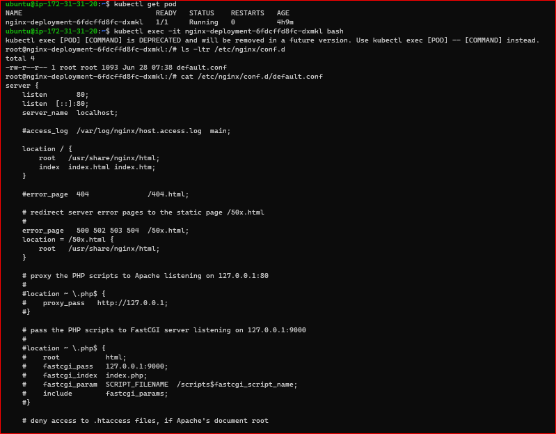
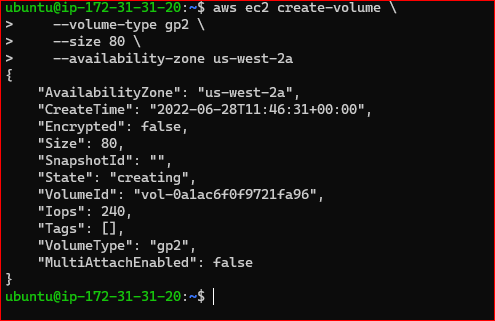
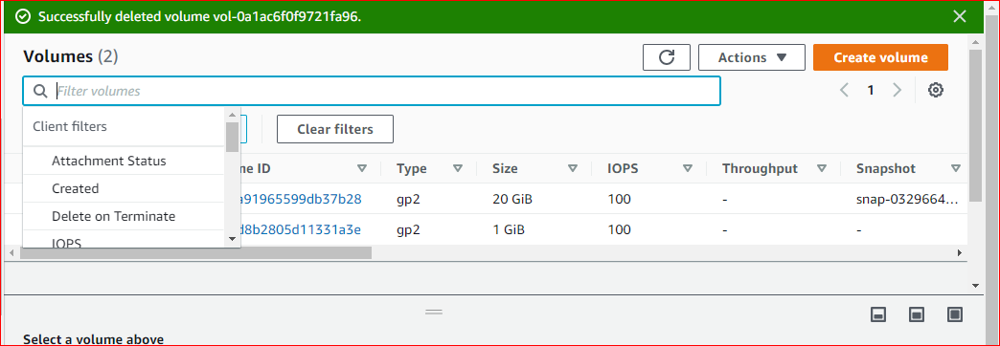
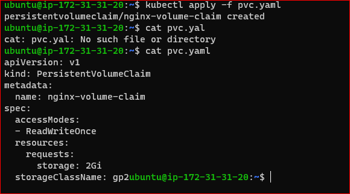
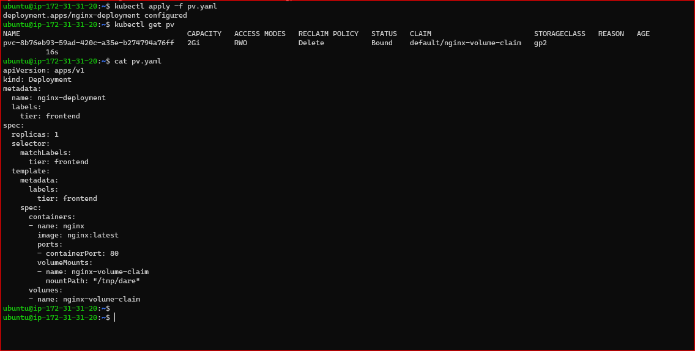
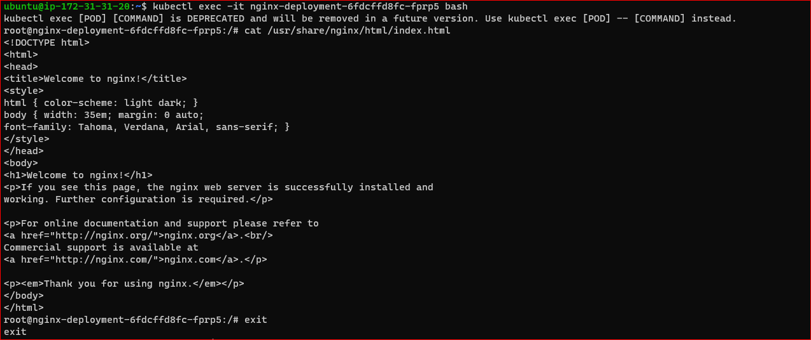
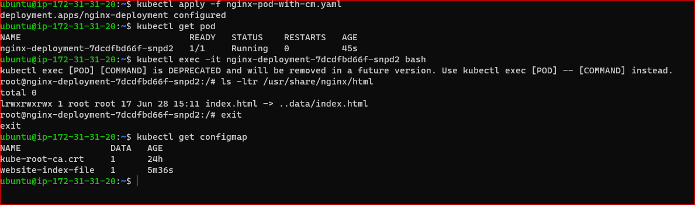
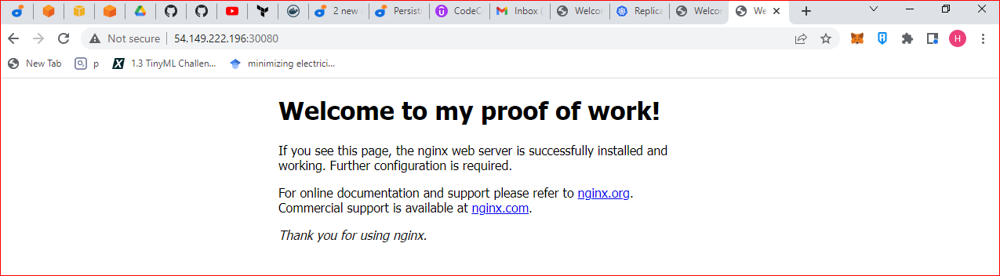

# PERSISTING-DATA-IN-KUBERNETES
project 23 of www.darey.io Project Based DevOps Learning Platform

Project 23 is a continuation of project 22

## SCOPE OF PROJECT:
- Ephemeral nature of pods and the need for persistent volume in case of pod crashing or when the pod is killed.

- The StorageClass makes persistent Volume possible.

- Dynamic and static Persistent Volume as well as Persistent Volume claim (request for storage).

- We also explored configmap. Which is k8s solution for Application configuration

NOTE: 

- Create EKS cluster using terraform github repo (https://github.com/hashicorp/terraform-provider-aws/tree/main/examples) first before the below section
- create volume in AWS console
- make sure volume is in the same region and AZ as your node

-Before you create a volume, lets run the nginx deployment into kubernetes without a volume.
```
sudo cat <<EOF | sudo tee ./nginx-pod.yaml
apiVersion: apps/v1
kind: Deployment
metadata:
  name: nginx-deployment
  labels:
    tier: frontend
spec:
  replicas: 3
  selector:
    matchLabels:
      tier: frontend
  template:
    metadata:
      labels:
        tier: frontend
    spec:
      containers:
      - name: nginx
        image: nginx:latest
        ports:
        - containerPort: 80
EOF
```
- TASK:
- Verify that the pod is running
- Check the logs of the pod
- Exec into the pod and navigate to the nginx configuration file /etc/nginx/conf.d
- Open the config files to see the default configuration.


- Create volume



- Copy the volume id on AWS and update the volume id in the file
```
 Update the deployment configuration with the volume spec.
sudo cat <<EOF | sudo tee ./nginx-pod.yaml
apiVersion: apps/v1
kind: Deployment
metadata:
  name: nginx-deployment
  labels:
    tier: frontend
spec:
  replicas: 1
  selector:
    matchLabels:
      tier: frontend
  template:
    metadata:
      labels:
        tier: frontend
    spec:
      containers:
      - name: nginx
        image: nginx:latest
        ports:
        - containerPort: 80
      volumes:
      - name: nginx-volume
        # This AWS EBS volume must already exist.
        awsElasticBlockStore:
          volumeID: "vol-0e194e56f1b5302ee"
          fsType: ext4
EOF
```
- Update mount point under volumeMounts
```
 cat <<EOF | tee ./nginx-pod.yaml
apiVersion: apps/v1
kind: Deployment
metadata:
  name: nginx-deployment
  labels:
    tier: frontend
spec:
  replicas: 1
  selector:
    matchLabels:
      tier: frontend
  template:
    metadata:
      labels:
        tier: frontend
    spec:
      containers:
      - name: nginx
        image: nginx:latest
        ports:
        - containerPort: 80
        volumeMounts:
        - name: nginx-volume
          mountPath: /usr/share/nginx/
      volumes:
      - name: nginx-volume
        # This AWS EBS volume must already exist.
        awsElasticBlockStore:
          volumeID: "  vol-07b537651bbe68be0"
          fsType: ext4
EOF
```

## MANAGING VOLUMES DYNAMICALLY WITH PVS AND PVCS
- Check for StorageClass

`kubectl get storageclass`
- Create StorageClass if you don't have
```
 kind: StorageClass
  apiVersion: storage.k8s.io/v1
  metadata:
    name: gp2
    annotations:
      storageclass.kubernetes.io/is-default-class: "true"
  provisioner: kubernetes.io/aws-ebs
  parameters:
    type: gp2
    fsType: ext4 
```
- Create a manifest file for a PVC, and based on the gp2 storageClass a PV will be dynamically created
```
    apiVersion: v1
    kind: PersistentVolumeClaim
    metadata:
      name: nginx-volume-claim
    spec:
      accessModes:
      - ReadWriteOnce
      resources:
        requests:
          storage: 2Gi
      storageClassName: gp2
```      

- Apply the file and run `kubectl get pvc`
NB: it is in a pending state because there's no pv that request fro pvc.
- Update manifest file to include PersistentVolumeClaim
```
 apiVersion: apps/v1
kind: Deployment
metadata:
  name: nginx-deployment
  labels:
    tier: frontend
spec:
  replicas: 1
  selector:
    matchLabels:
      tier: frontend
  template:
    metadata:
      labels:
        tier: frontend
    spec:
      containers:
      - name: nginx
        image: nginx:latest
        ports:
        - containerPort: 80
        volumeMounts:
        - name: nginx-volume-claim
          mountPath: "/tmp/dare"
      volumes:
      - name: nginx-volume-claim
        persistentVolumeClaim:
          claimName: nginx-volume-claim
```
- Apply and get pv
```
kubectl apply nginx-pod.yaml
kubectl get pv
```


## CONFIGMAP
- Remove the volumeMounts and PVC sections of the manifest and use kubectl to apply the configuration

- port forward the service and ensure that you are able to see the "Welcome to nginx" page

- exec into the running container and keep a copy of the index.html file somewhere. For example
```
kubectl exec -it nginx-deployment-79d8c764bc-j6sp9 -- bash
  cat /usr/share/nginx/html/index.html 
```

- Copy the output and save the file on your local pc because we will need it to create a configmap.

## Persisting configuration data with configMaps
- Create manifest
```
 cat <<EOF | tee ./nginx-configmap.yaml
apiVersion: v1
kind: ConfigMap
metadata:
  name: website-index-file
data:
  # file to be mounted inside a volume
  index-file: |
    <!DOCTYPE html>
    <html>
    <head>
    <title>Welcome to nginx!</title>
    <style>
    html { color-scheme: light dark; }
    body { width: 35em; margin: 0 auto;
    font-family: Tahoma, Verdana, Arial, sans-serif; }
    </style>
    </head>
    <body>
    <h1>Welcome to nginx!</h1>
    <p>If you see this page, the nginx web server is successfully installed and
    working. Further configuration is required.</p>

    <p>For online documentation and support please refer to
    <a href="http://nginx.org/">nginx.org</a>.<br/>
    Commercial support is available at
    <a href="http://nginx.com/">nginx.com</a>.</p>

    <p><em>Thank you for using nginx.</em></p>
    </body>
    </html>
EOF
```
- Apply manifest

` kubectl apply -f nginx-configmap.yaml`

- Update the deployment file to use the configmap in the volumeMounts section
```
cat <<EOF | tee ./nginx-pod-with-cm.yaml
apiVersion: apps/v1
kind: Deployment
metadata:
  name: nginx-deployment
  labels:
    tier: frontend
spec:
  replicas: 1
  selector:
    matchLabels:
      tier: frontend
  template:
    metadata:
      labels:
        tier: frontend
    spec:
      containers:
      - name: nginx
        image: nginx:latest
        ports:
        - containerPort: 80
        volumeMounts:
          - name: config
            mountPath: /usr/share/nginx/html
            readOnly: true
      volumes:
      - name: config
        configMap:
          name: website-index-file
          items:
          - key: index-file
            path: index.html
EOF
```

- List the /usr/share/nginx/html directory

`ls -ltr ist the /usr/share/nginx/html directory`
- make sure you see the ..data/index.html directory
- List the available configmaps

`kubectl get cm`
- Update the configmap. You can either update the manifest file, or the kubernetes object directly

`kubectl edit cm website-index-file `
- change the HTML par only to anthing you like
```
 apiVersion: v1
kind: ConfigMap
metadata:
  name: website-index-file
data:
  # file to be mounted inside a volume
  index-file: |
    <!DOCTYPE html>
    <html>
    <head>
    <title>Welcome to my proof of work!</title>
    <style>
    html { color-scheme: light dark; }
    body { width: 35em; margin: 0 auto;
    font-family: Tahoma, Verdana, Arial, sans-serif; }
    </style>
    </head>
    <body>
    <h1>Welcome to DAREY.IO!</h1>
    <p>If you see this page, It means you have successfully updated the configMap data in Kubernetes.</p>

    <p>For online documentation and support please refer to
    <a href="http://DAREY.IO/">DAREY.IO</a>.<br/>
    Commercial support is available at
    <a href="http://DAREY.IO/">DAREY.IO</a>.</p>

    <p><em>Thank you and make sure you are on Darey's Masterclass Program.</em></p>
    </body>
    </html>
```
- save and exit. Without restarting the pod, your site should be loaded automatically.

- If you wish to restart the deployment for any reason, simply use the command

`kubectl rollout restart deploy nginx-deployment` 
- This will terminate the running pod and spin up a new one.

# END OF PROJECT 23 DOCUMENTATION


