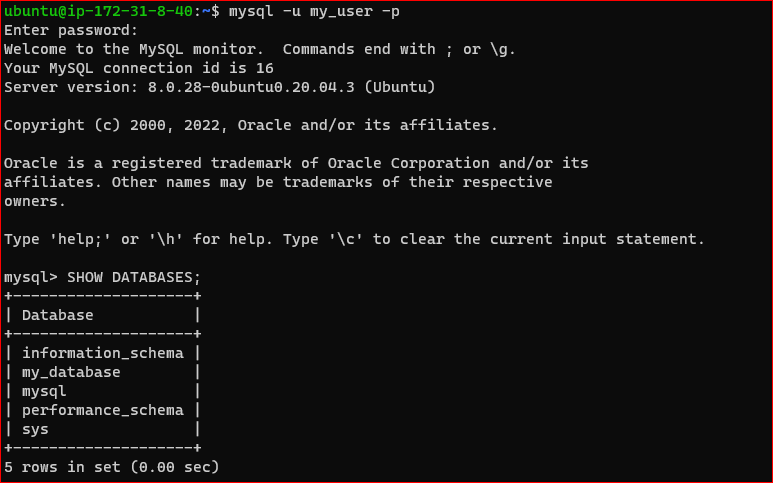
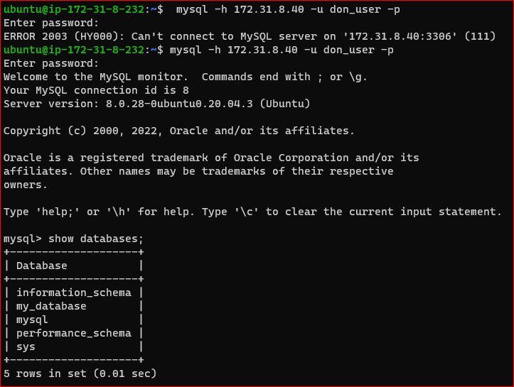

# IMPLEMENT A CLIENT SERVER ARCHITECTURE USING MYSQL DATABASE MANAGEMENT SYSTEM (DBMS).

-Create and configure two Linux-based virtual servers (EC2 instances in AWS).

Server A name - `mysql server`

Server B name - `mysql client`

-On mysql server

`sudo apt install mysql-server`

`sudo mysql_secure_installation`

`sudo mysql`

`[CREATE DATABASE 'my_database';]`

`[CREATE USER 'don_user'@'%' IDENTIFIED WITH mysql_native_password BY 'password';]`

`[ GRANT ALL ON my_database.* TO 'don_user'@'%';]`

`exit`

`mysql -u don_user -p`

` SHOW DATABASES;`

-On client 

`sudo apt install mysql-client`

-Open server TCP port 3306 from inbound rules

-On server

`sudo vi /etc/mysql/mysql.conf.d/mysqld.cnf`

-Under bind address, Replace ‘127.0.0.1’ to ‘0.0.0.0’

-On mysql client

`mysql -h <server_private_IP> -u <db_username> -p`

`Show databases;`

# END OF PROJECT-5
